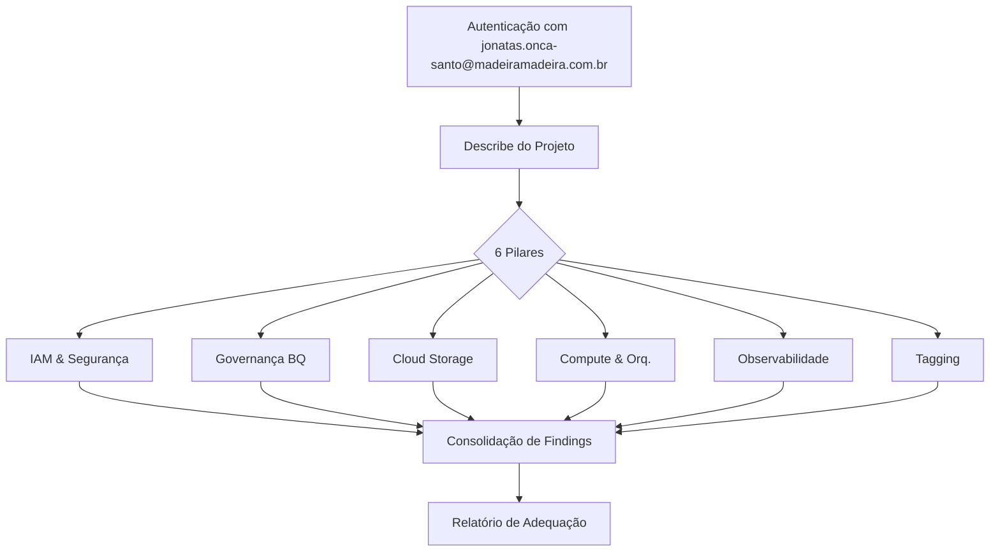

# Metodologia de Análise — Projeto GCP `mm-data-ga360`

## Objetivo
Auditar o projeto GCP `mm-data-ga360` de forma estruturada, identificando gaps em relação às boas práticas de governança, segurança, observabilidade e padronização de dados para produzir um relatório de adequação.

---

## Fontes de Referência (Padrão)
| Referência | Descrição |
|---|---|
| [Google Cloud Architecture Framework](https://cloud.google.com/architecture/framework) | Guia de boas práticas de segurança, eficiência e confiabilidade |
| [CIS Google Cloud Benchmark](https://www.cisecurity.org/benchmark/google_cloud_computing_platform) | Benchmark de segurança para projetos GCP |
| [BigQuery Best Practices (Google)](https://cloud.google.com/bigquery/docs/best-practices-performance-overview) | Práticas de governança e performance em BQ |
| [Google Cloud IAM Security Best Practices](https://cloud.google.com/iam/docs/using-iam-securely) | Modelo de menor privilégio e uso de grupos |
| [GCS Data Lifecycle Management](https://cloud.google.com/storage/docs/lifecycle) | Política de ciclo de vida e versionamento |

---

## Pilares de Análise

### 1. IAM & Segurança
**Objetivo:** Verificar se o controle de acesso segue o princípio do menor privilégio e usa grupos em vez de usuários individuais.

**Comandos utilizados:**
```bash
gcloud auth list
gcloud projects describe mm-data-ga360
gcloud projects get-iam-policy mm-data-ga360 --format=json
gcloud iam service-accounts list --project=mm-data-ga360
```

**Critérios avaliados:**
- Presença de usuários com roles primitivas (`roles/owner`, `roles/editor`)
- Uso de grupos de IAM vs usuários individuais
- Service Accounts desnecessários ou desabilitados
- Ausência de configuração de Workload Identity / SA com escopo mínimo

---

### 2. Governança de BigQuery
**Objetivo:** Avaliar organização, documentação e políticas de expiração dos datasets.

**Comandos utilizados:**
```bash
bq ls --project_id=mm-data-ga360 --max_results=100
bq show --format=json mm-data-ga360:<dataset>
```

**Critérios avaliados:**
- Presença de `labels` nos datasets
- Presença de `description` nos datasets
- Configuração de `defaultTableExpirationMs` em datasets de staging/temp
- Organização lógica dos datasets (camadas raw / staging / output)
- Datasets com nomes de "temp" ou "teste" em produção

---

### 3. Cloud Storage (GCS)
**Objetivo:** Avaliar configuração dos buckets quanto à durabilidade e governança.

**Comandos utilizados:**
```bash
gsutil ls -p mm-data-ga360
gsutil ls -L -b gs://<bucket>
```

**Critérios avaliados:**
- Versionamento habilitado
- Política de ciclo de vida (lifecycle)
- Logging de acesso configurado
- Retenção de dados definida
- Labels nos buckets

---

### 4. Compute & Orquestração
**Objetivo:** Inventariar serviços de processamento e verificar padronização.

**Comandos utilizados:**
```bash
gcloud functions list --project=mm-data-ga360
gcloud run services list --project=mm-data-ga360
gcloud dataflow jobs list --project=mm-data-ga360
gcloud composer environments list --locations=... --project=mm-data-ga360
gcloud scheduler jobs list --project=mm-data-ga360
gcloud artifacts repositories list --project=mm-data-ga360
```

**Critérios avaliados:**
- Cloud Functions em versão 1st gen (obsoleta)
- Uso de Container Registry vs Artifact Registry
- Presença ou ausência de orquestrador (Composer/Airflow)
- Jobs de Dataflow ativos

---

### 5. Observabilidade & Monitoramento
**Objetivo:** Verificar se existem alertas e dashboards configurados.

**Comandos utilizados:**
```bash
gcloud monitoring policies list --project=mm-data-ga360
gcloud secrets list --project=mm-data-ga360
```

**Critérios avaliados:**
- Políticas de alertas de monitoramento
- Uso do Secret Manager para credenciais
- Configuração de logs de acesso nos GCS

---

### 6. Tagging & Rastreabilidade do Projeto
**Objetivo:** Verificar se o projeto possui metadados de rastreabilidade adequados.

**Critérios avaliados:**
- Presença da tag `environment` no projeto (Production/Development/Staging)
- Labels nos recursos (datasets, buckets, SAs)
- Coerência entre labels do projeto e labels dos recursos

---

## Processo de Análise



---

## Limitações da Análise
- Usuário `jonatas.onca-santo@madeiramadeira.com.br` não possui acesso ao Cloud Monitoring (`roles/monitoring`) — alertas não puderam ser completamente inspecionados.
- Análise realizada via CLI (`gcloud`, `bq`, `gsutil`) sem acesso ao Console visual do GCP.
- Não foi possível inspecionar conteúdo individual das tabelas BigQuery (análise restrita a metadados de datasets).
- Secrets individuais não estão visíveis (sem permissão para listar).
